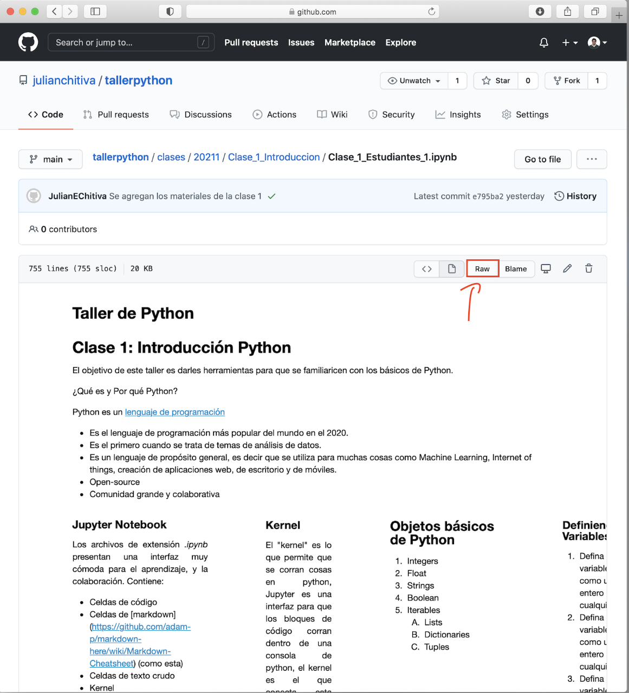
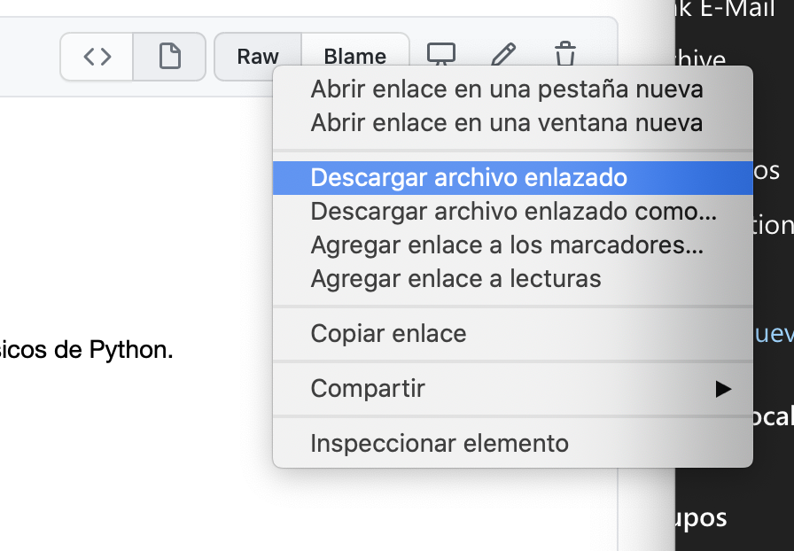

[Página Principal](./README.md)

# Instrucciones para descargar los archivos de clase

1. Van al link <https://julianchitiva.github.io/tallerpython/>
2. En la parte de Clase 1 le dan click al link de [Descargar Estudiantes] (Esta es la versión no solucionada de la clase, la otra es la solución.)
3. Verán esta pantalla, deben hacer click derecho en el botón Raw y "Descargar archivo enlazado" o "Guardar enlace como"(Mac), o "Guardar enlace como..."(Windows) . 

4. Es posible que este descargue como un archivo .txt, si esto pasa es solo quitarle el .txt del nombre del archivo y listo. Es importante que la extensión del archivo sea .ipynb

